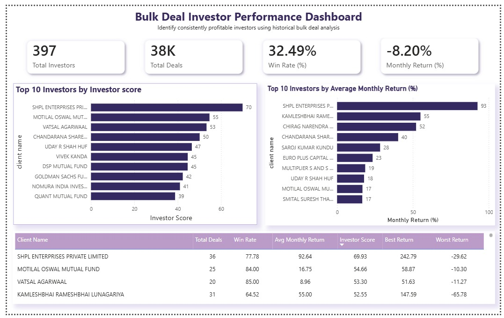
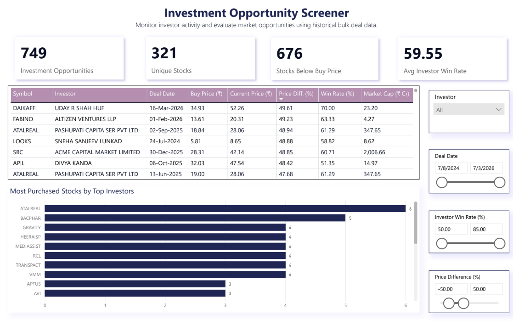

# Indian Equity Research

This repository captures an Indian equity research project built around market data analysis, analytical dashboarding, and automated data pipeline workflows.

## Project Overview

This project brings together:
- market data ingestion from Indian exchanges (NSE/BSE)
- transaction and market cap delta processing
- exploratory and validation analytics in notebooks
- SQL-driven anomaly detection and trend analysis
- dashboard artifacts for investment opportunity and bulk deal performance analysis

## Architecture

The repository is organized to reflect a data pipeline and analytics architecture:

1. Data ingestion
   - `pipeline/` contains notebooks to ingest daily and incremental market data for NSE and BSE bulk deals, block trades, trade records, security master updates, and market cap changes.
2. Data transformation
   - The pipeline notebooks prepare delta datasets, clean raw inputs, and standardize records for downstream analysis.
3. Analytical workspace
   - `notebooks/` contains exploratory analysis notebooks for market updates, security behavior, trade delta assessment, and sector/industry lookups.
4. SQL analytics
   - `sql/` contains analytical queries for anomaly detection, data validation, view creation, and exploratory analysis of price momentum, breakout strength, and deal structures.
5. Reporting/dashboard layer
   - `docs/` contains exported dashboard artifacts and architecture visuals representing the business intelligence layer.

The included diagrams (`docs/pipeline_overview.png`, `docs/warehouse_schema.png`) document the flow from raw data ingestion through staging and analytical consumption.

## Dashboard Insights

The dashboard artifacts in `docs/dashboards/` capture the project’s analytical outcomes in a concise, business-friendly format.

### Bulk deal investor performance dashboard

This dashboard highlights investor participation, bulk deal activity, and performance patterns across major securities and sectors. It is particularly useful for monitoring institutional flow, assessing deal quality, and identifying notable trading signals.

### Investment opportunity dashboard

This dashboard surfaces potential investment opportunities by combining market context, sector trends, and relative strength indicators. It provides a clear view of promising candidates for deeper research and portfolio evaluation.

Together, these dashboards reflect the project’s value proposition: using exchange and market data to generate actionable research and portfolio insights.

## Project Structure

- `docs/`
  - dashboard exports, visual summaries, and architecture diagrams.
- `notebooks/`
  - exploratory analysis and preprocessing notebooks.
- `pipeline/`
  - ingestion and delta processing notebooks for NSE/BSE data.
- `sql/`
  - SQL queries for validation, anomaly detection, and exploratory data analysis.

## Key Files

- `notebooks/01_data_exploration.ipynb` — initial discovery and market data exploration.
- `notebooks/04_data_preprocessing.ipynb` — data cleaning and preprocessing logic.
- `pipeline/pl_11_trade_daily_delta.ipynb` — daily trade delta generation.
- `sql/anomaly_detection.sql` — identifies unusual market events or data issues.
- `sql/eda_01_price_momentum_analysis.sql` — price momentum analysis.
- `sql/eda_02_breakout_strength_analysis.sql` — breakout and trend strength analysis.

## Getting Started

1. Open this repository in VS Code.
2. Use the Jupyter extension to run notebooks interactively.
3. Ensure Python and Jupyter are installed.
4. Load or connect to your market data sources before running pipeline notebooks.

## Notes

- Data source files are not included in this repository.
- Update notebook paths, connection details, and data references as needed for your environment.
- The repository captures the research artifacts, ETL pipeline approach, and dashboard insights for Indian equity market analysis.
